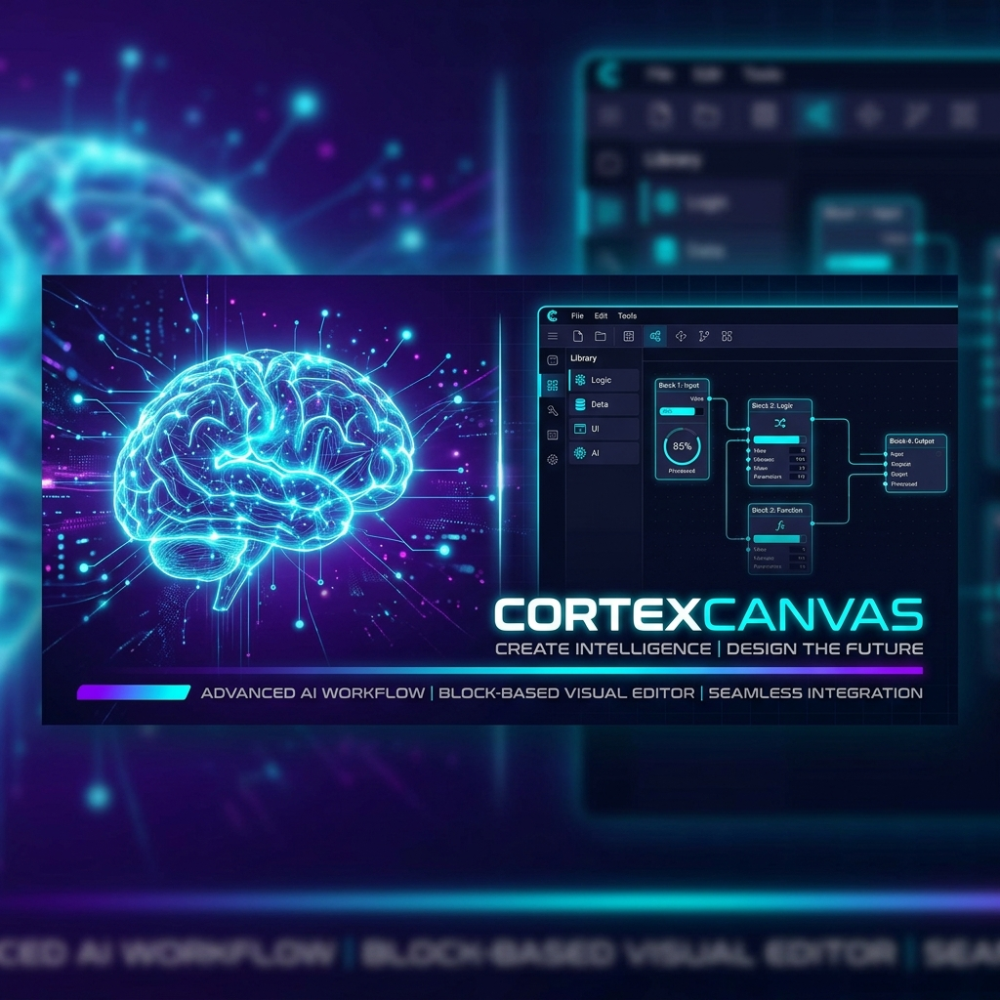

# 🧠 CortexCanvas



### **The AI-Powered Knowledge Workspace for the Modern Mind**

CortexCanvas is a next-generation collaborative platform that fuses the flexibility of block-based editing with the power of generative AI. Inspired by Notion but built for an AI-first workflow, it allows teams and individuals to co-create, organize, and interact with their knowledge base in real-time.

---

## ✨ Key Features

- **🚀 Real-Time Collaboration**: Powered by **Hocuspocus** and **Yjs**, enabling seamless multi-user editing with live cursors, shared awareness, and robust conflict resolution.
- **🤖 Integrated AI Assistant**: Context-aware AI that lives directly in your documents. Ask questions, generate summaries, and refine content through a native chat interface or inline bubble menus.
- **🧱 Block-Based Rich Text Editor**: A highly customizable editor built on **Tiptap**, supporting tables, code blocks, task lists, and interactive media.
- **🔍 Semantic Search & RAG**: Advanced knowledge retrieval (Retrieval-Augmented Generation) that understands the context of your notes, not just keywords.
- **📁 Multi-Format Support**: Upload and process PDFs and Word documents, converting them into interactive knowledge blocks automatically.
- **🔄 Version Control**: Track every change and revert to previous states with built-in document versioning and activity logging.
- **🏷️ Smart Organization**: Organize your workspace with tags, categories, and a structured sidebar for efficient knowledge management.

---

## 🛠️ Tech Stack

### **Frontend & UI**
- **Framework**: [Next.js 15](https://nextjs.org/) (App Router, Server Components)
- **Styling**: [Tailwind CSS](https://tailwindcss.com/) with a custom **Neobrutalist & Glassmorphic** design system.
- **Animations**: [Framer Motion](https://www.framer.com/motion/) for fluid transitions and micro-interactions.
- **Icons**: [Lucide React](https://lucide.dev/)
- **State Management**: [Zustand](https://github.com/pmndrs/zustand)

### **Core Engine**
- **Editor Architecture**: [Tiptap](https://tiptap.dev/) / [ProseMirror](https://prosemirror.net/)
- **Collaboration**: [Yjs](https://yjs.dev/) & [Hocuspocus](https://tiptap.dev/hocuspocus) for CRDT-based sync.
- **AI Integration**: [Vercel AI SDK](https://sdk.vercel.ai/) & [OpenAI](https://openai.com/) (GPT-4o/o1).

### **Backend & Storage**
- **Database**: [SQLite](https://www.sqlite.org/) managed via [Prisma ORM](https://www.prisma.io/).
- **Authentication**: [NextAuth.js v5](https://authjs.dev/) (Auth.js).
- **Storage**: [Supabase](https://supabase.com/) for file uploads and asset management.

---

## 🚀 Getting Started

### Prerequisites
- **Node.js** 18.x or higher
- **npm** or **pnpm**
- **OpenAI API Key** (for AI features)
- **Supabase Account** (for storage)

### Installation

1. **Clone the repository:**
   ```bash
   git clone https://github.com/your-username/cortex-canvas.git
   cd cortex-canvas
   ```

2. **Install dependencies:**
   ```bash
   npm install
   ```

3. **Environment Setup:**
   Copy the `.env.example` to `.env` and fill in your credentials:
   ```bash
   cp .env.example .env
   ```
   *Required variables: `DATABASE_URL`, `NEXTAUTH_SECRET`, `OPENAI_API_KEY`, `NEXT_PUBLIC_SUPABASE_URL`, `NEXT_PUBLIC_SUPABASE_ANON_KEY`.*

4. **Initialize Database:**
   ```bash
   npx prisma generate
   npx prisma db push
   ```

5. **Run Development Server:**
   ```bash
   npm run dev
   ```

Open [http://localhost:3000](http://localhost:3000) in your browser.

---

## 🏗️ Architecture Overview

CortexCanvas follows a modular, feature-based architecture to ensure scalability and maintainability:

- **`src/features/editor`**: The heart of the application. Handles Tiptap extensions, Yjs WebSocket providers, and collaborative UI components.
- **`src/features/ai-assistant`**: Manages RAG pipelines, streaming AI responses, and prompt templates for document processing.
- **`src/lib`**: Shared utilities, including the Prisma client, Supabase config, and global helper functions.
- **`src/app`**: Next.js App Router structure defining the page layouts and routing logic.

---

## 🤝 Contributing

We welcome contributions from the community! Whether it's a bug fix, a new feature, or documentation improvements.

1. Fork the Project
2. Create your Feature Branch (`git checkout -b feature/AmazingFeature`)
3. Commit your Changes (`git commit -m 'Add some AmazingFeature'`)
4. Push to the Branch (`git push origin feature/AmazingFeature`)
5. Open a Pull Request

---

## 📄 License

Distributed under the MIT License. See `LICENSE` for more information.

---

<p align="center">
  <b>Built with precision for the future of knowledge work.</b><br>
  <sub>Made with ❤️ by the CortexCanvas Team</sub>
</p>
